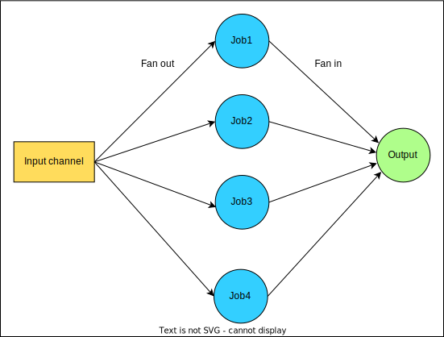

#### Fan-in/Fan-out pattern trong Golang là gì?

Fan-in/Fan-out pattern là một concurrency design pattern thường sử dụng trong Go chạy đồng thời và kết hợp các task với nhau. Nó có tác dụng trong trường hợp bạn có 1 task tốn nhiều thời gian, bạn có thể chia task đó thành các task nhỏ hơn và thực hiện chungs đồng thời.

### Cách hoạt động

Fan-in/Fan-out bao gồm 2 stage chính: Fan out và Fan in

1. Fan-out: Trong stage này, 1 task được chia thành nhiều task nhỏ hơn, các task nhỏ(subtasks). Mỗi subtask sau đó sẽ được giao cho các Goroutine riêng để thực thi đồng thời. Stage này phân chia khối lượng công việc sang nhiều các goroutine khác, cho phép xử lý đồng thời các công việc.

2. Fan-in: Trong stage này, output từ tất cả các subtask chạy đồng thời trước đó sẽ được thu thập và kết hợp lại thành 1 kết quả duy nhất. Stage này đợi tất cả các subtasks thực thi xong và tập hợp các ouput của chúng. Fan-in stage cũng xử lý sự đồng bộ và phối hợp giữa các goroutine để chắc chắn rằng tất cả các ouput được thu thập trước khi tiến hành xử lý.



### Cách cài đặt

Fan-out/Fan-in pattern được cài đặt bằng cách sử dụng kết hợp goroutine và chanel trong Go. Mỗi subtask được giao cho 1 goroutine, và chanel được sử dụng để truyền data giữa các goroutine. Fan-in stage đợi các subtask hoàn thành bằng cách sử dụng các phương pháp đồng bộ hóa, ví dụn như WaitGroups hoặc sử dụng chanel để gửi tín hiệu hoàn thành từ các subtask.

### Ví dụ 

```go
package main

import (
	"fmt"
	"time"
)

const (
	numJob    = 100
	numWorker = 5
)

//Fan-out stage
func createJob(jobs chan<- int) {
	for i := 0; i < numJob; i++ {
		jobs <- i
	}
	close(jobs)
}

func doJob(worker int, jobs chan int, res chan string) {
	for job := range jobs {
		time.Sleep(2)
		res <- fmt.Sprintf("worker %v is doing job %v", worker, job)
	}
}

func main() {
	jobs := make(chan int, numJob)
	results := make(chan string)

	createJob(jobs)

	for i := 0; i < numWorker; i++ {
		go doJob(i, jobs, results)
	}

    //Fan-in stage
	for i := 0; i < numJob; i++ {
		fmt.Println(<-results)
	}
}

```
